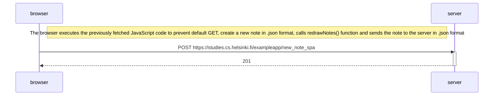

```mermaid
sequenceDiagram
    participant browser
    participant server

    Note right of browser: The browser executes the previously fetched JavaScript code to prevent default GET, create a new note in .json format, calls redrawNotes() function and sends the note to the server in .json format

    browser->>server: POST https://studies.cs.helsinki.fi/exampleapp/new_note_spa
    activate server
    server-->>browser: 201
    deactivate server

```